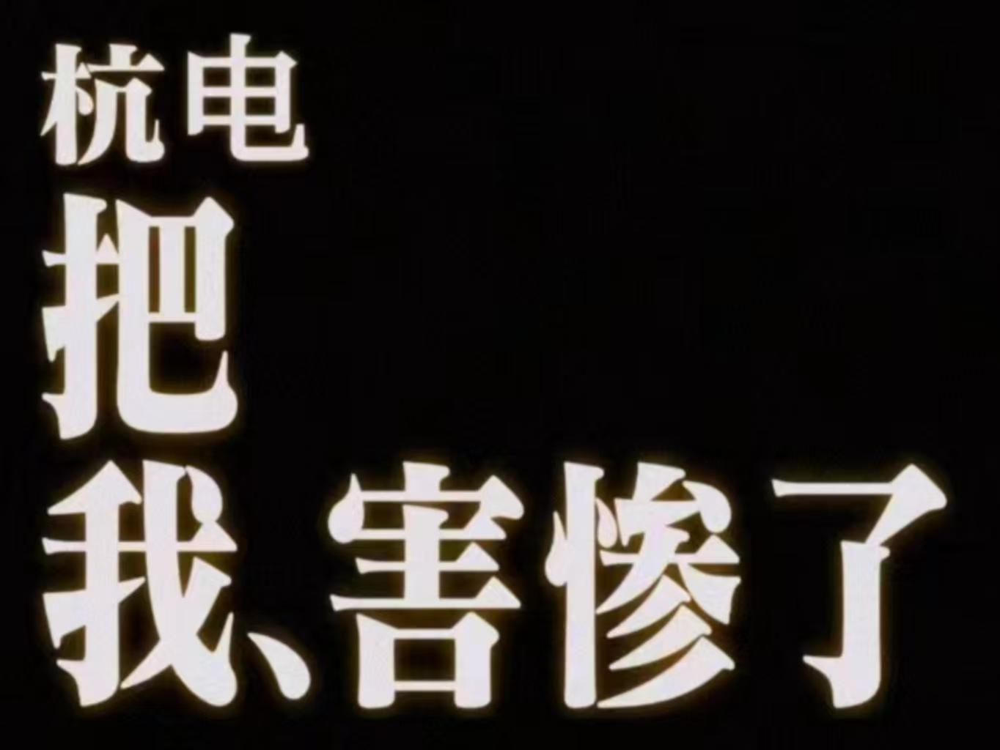

# HDU-Intelligent-ST-Wiki

## 智能科学与技术专业学习指南

本项目旨在为智能科学与技术专业的同学提供学习建议与课程资料，帮助大家更快熟悉本专业，跟上大学节奏。

## 写在前面

大家好，这里是 Mio。

我的本科可以说是摸着是石头过河，有惊无险，但是 **在学习和成长的过程中，我得到了许多老师、学长学姐和同学的帮助。感谢学校为我提供了很好的平台，也感谢一路上遇到的每一位认真负责、给予我帮助的老师和同学，谢谢你们。**

因此，我希望通过整理和分享这份资料，将这份帮助继续传递下去，也让 **开源、共享与互助** 的精神延续下去。

智能科学与技术是一门交叉性较强的专业，课程内容涉及人工智能、计算机、自动化、信息处理等多个领域。面对较为广泛的知识体系，初学者难免感到迷茫。本项目整理了部分专业课程复习资料、学习建议与个人经验，希望能够为大家的课程学习和能力提升提供参考。

在课程学习和课外拓展过程中，请大家善于使用 **AI 工具**。身处人工智能快速发展的时代，合理使用 AI 能够减少大量重复性工作，并辅助知识梳理、概念拆解与问题分析。但与此同时，也应保持独立思考，并对 AI 生成的内容进行必要的核实。

此外，也应重视 **信息检索能力** 的培养。无论是检索论文，还是查找培养方案、课程文件和相关通知，都应尽量先自行搜索与核实，逐步提升信息素养，避免过度依赖他人直接提供答案。

遇到不熟悉的知识点，或者有课堂上没听懂的内容时，可以在 [哔哩哔哩](https://www.bilibili.com/) 等平台查找相关课程和讲解，有时也能找到比课堂讲解更适合自己的学习方式。

同时，请定期查阅 [杭州电子科技大学自动化学院官网](https://ac.hdu.edu.cn/main.htm)，及时关注学院发布的重要通知。

> 受个人能力与经验所限，部分内容可能存在疏漏或错误，欢迎大家指正、补充与共同完善。

> 本项目所涉及的内容，也只是大学学习生活中的冰山一角。受限于个人精力和表达，其他部分就不再继续展开。~~本人阅历还没有丰富到可以剖析"大学本质"。~~

## 正文

本项目目前主要分为以下几个板块，希望能够从课程选择、期末复习、课外拓展和推免准备等方面，为大家提供一些参考。

### 选课推荐

大学里的选修课和体育课虽然学分占比不高，但选得合适，往往能够在相对轻松的学习过程中取得不错的成绩，也能减少不必要的时间和精力投入。

本部分主要整理部分 **选修课程和体育课程** 的选课体验，包括教师授课方式、课程难度、考核形式以及成绩情况等，希望能够为大家选课提供一些参考，帮助大家少走弯路。

> 选课评价具有一定主观性，不同老师的授课方式、考核形式和课程安排也可能随学期发生变化，请结合自身兴趣和实际情况选择，并以当学期课程安排为准。

### 课程资料

由于专业课采用题库抽题等形式，历年试卷通常较难完整流传，因此期末复习时，明确课程重点和整理知识框架往往更加重要。

本部分主要整理智能科学与技术专业部分课程的复习资料，以专业课为主。资料主要来源于课程学习过程中的个人整理、教师课堂强调的重点，以及根据考试范围搜集和归纳的相关内容。

这些资料主要用于减少重复整理的时间，提高复习效率，也建议大家结合课件、教材和课堂内容进行理解与补充。

另外，也可以充分利用 [杭电智慧课堂](https://course.hdu.edu.cn/#/video)。课堂录播通常会在课程结束后 **24 小时内** 同步到平台，复习时可以用来回看课堂内容、补充遗漏的知识点。可以通过浏览器开发者工具（F12）查看页面的媒体资源，定位对应的录播视频文件 (.mp4) 用于共享。

对于 **高等数学、线性代数、概率论** 等基础课程，也可以加入 QQ 群 **「未央数学营」**：

* QQ 群号：`682906443`

群内有一些可供复习参考的课程资料，可以根据自己的需要进行查找和使用。

对于 **高等数学、线性代数、概率论** 等基础课程，也可以加入 QQ 群 **「未央数学营」**：

* QQ 群号：`682906443`

群内有一些可供复习参考的课程资料，可以根据自己的需要进行查找和使用。

### 进阶资料

本科阶段需要接触的课程繁多，能够帮助我们建立广泛的知识体系，但仅依靠课堂内容往往很难深入掌握某一个具体方向。因此，对于学有余力或希望进一步提升专业能力的同学，可以在课外选择感兴趣的方向继续学习。

首先建议大家尽早熟悉 **Word、Excel、PowerPoint** 等常用办公软件。无论是课程作业、实验报告、项目汇报还是科研工作，良好的文档整理和展示能力都十分重要。虽然 AI 可以帮助我们提高效率，但最终的内容组织、逻辑表达和个人思考仍然需要自己完成。

此外，本部分整理了一些我在学习 **深度学习及相关方向** 时接触过的书籍、课程和学习资源，帮助大家进一步理解相关知识体系，并为后续竞赛、科研项目和进入实验室打下一定基础。

同时，本部分也会分享一些我个人的 ~~(不太靠谱的)~~  **雅思备考与短期冲刺经验**。对于有保研、出国交流或英语成绩提升需求的同学，可以作为参考，根据自己的英语基础和时间安排选择适合的备考方式。

### 推免相关

随着学校推免名额和相关机会逐渐增加，推免也成为本科阶段值得提前了解的一条升学路径。

> **最新情报**：2026 自动化学院已经卷爆了，在普/特推免总名额增加33%的同时，普保最低分数线往上爆涨26分 **(328→354)** TT

> 求稳的同学可以开始准备学术推免的高水平成果了 orz

  (狗头保命.jpg)

本部分主要整理与推免相关的学校文件、政策信息以及经验总结，希望帮助有推免计划的同学更早了解基本流程和时间节点，并提前做好课程成绩、英语能力、科研竞赛和材料准备等方面的规划。

需要注意的是，**推免政策每年都可能发生变化**。本项目中的内容主要用于经验参考，涉及名额、排名计算、加分规则和申请要求等重要信息时，请务必以学校、学院及目标院校当年发布的官方通知为准。

# 结语

希望大家都能度过一段充实而有意义的本科时光。

成长的道路不会始终平坦，途中难免会遇到迷茫、挫折与压力。

本科四年更考验的往往不是一时的天赋，而是长期坚持、持续积累和主动选择的能力。四年的时间足以让一个人实现改变，甚至甚至后来居上。

明确自己的目标，并为之持续努力。即使最终的结果与最初设想有所不同，这段认真投入的经历，也一定会带来属于自己的收获。

感到迷茫或疲惫时，也不要忘记暂时停下来，出去走一走、散散心。适当休息并不是逃避，而是为了以更好的状态重新出发。

最后，推荐一首歌（私货）：

[《先生、人生▇▇です。》](https://www.bilibili.com/video/BV1Xdpze7Ej5/)

# 友情链接

[不白学姐的智科指南](https://github.com/Jaserrr/Intelligent-ST-Wiki)
